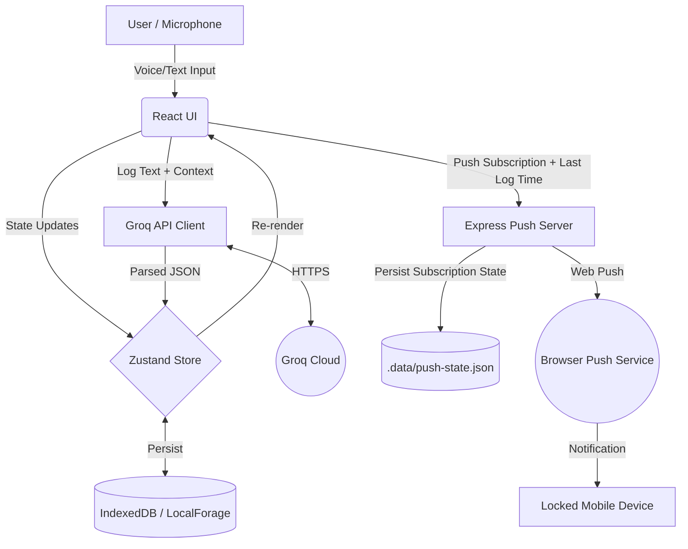

# High-Level System Architecture

## Overview
GRIND is a local-first, AI-powered productivity tracker. It uses a React-based frontend, local browser storage for data persistence, a small Express companion server for Web Push reminders, and the Groq API for intelligent log analysis. It includes voice-to-text capabilities via the native browser Web Speech API.

## Technology Stack
*   **Frontend Framework:** React 19.0.0
*   **Build Tool:** Vite 6.2.0
*   **Styling:** Tailwind CSS 4.1.14
*   **State Management:** Zustand (with `localforage` for IndexedDB persistence)
*   **AI Integration:** Groq OpenAI-compatible Chat Completions API using `llama-3.3-70b-versatile`
*   **Push Reminders:** Express + Web Push using VAPID keys
*   **Voice Recognition:** Native Web Speech API (`SpeechRecognition`)
*   **Routing:** React Router DOM
*   **Charts:** Recharts

## Infrastructure Diagram
GRIND is still local-first for productivity data, but closed-device reminders require a backend because mobile browsers pause timers when the app is closed.

## Data Flow: Logging an Entry
1.  **Input:** The user types or speaks into the Quick Log input. If speaking, the Web Speech API transcribes audio to text in real-time.
2.  **Optimistic UI:** Upon submission, the log is immediately saved to the Zustand store with `null` AI fields and rendered on the screen.
3.  **AI Processing:** The `analyzeLogEntry` function is called. It gathers the new log, the last 5 logs, active goals, and wake time, packaging them into a strict prompt.
4.  **External Call:** The prompt is sent to the Groq API requesting a structured JSON response.
5.  **State Resolution:** Once Groq returns the JSON (score, category, alignment, insight, warning), the Zustand store is updated.
6.  **Dashboard Update:** The `updateDailyScore` action recalculates the day's average score and alignment percentage, persisting the final state to IndexedDB.
7.  **Reminder Sync:** The frontend reports the latest log timestamp to `/api/push/activity`. The backend resets reminder escalation state and starts checking for the next idle window.

## Data Flow: Closed-Mobile Push Reminder
1.  **Permission:** In Settings, the user enables aggressive notifications. The browser requests notification permission and creates a `PushSubscription`.
2.  **Subscription Save:** The frontend posts that subscription to `/api/push/subscribe`.
3.  **Idle Detection:** The backend scheduler checks the latest log timestamp every minute by default.
4.  **Escalation:** If the user has not logged again, the backend sends Web Push reminders at 60, 75, 90, and 120 minutes.
5.  **Notification Display:** The service worker receives the push event and displays the aggressive notification. Clicking it opens the app.
