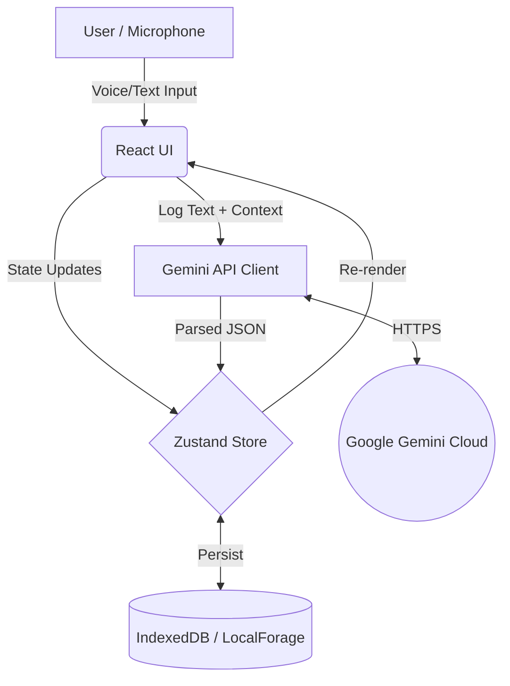

# High-Level System Architecture

## Overview
GRIND is a local-first, AI-powered productivity tracker. It uses a React-based frontend, local browser storage for data persistence, and the Google Gemini API for intelligent log analysis. It includes voice-to-text capabilities via the native browser Web Speech API.

## Technology Stack
*   **Frontend Framework:** React 19.0.0
*   **Build Tool:** Vite 6.2.0
*   **Styling:** Tailwind CSS 4.1.14
*   **State Management:** Zustand (with `localforage` for IndexedDB persistence)
*   **AI Integration:** `@google/genai` (^1.29.0) using `gemini-3-flash-preview`
*   **Voice Recognition:** Native Web Speech API (`SpeechRecognition`)
*   **Routing:** React Router DOM
*   **Charts:** Recharts

## Infrastructure Diagram
Since GRIND is a Client-Side Application (SPA/PWA), the "infrastructure" is primarily the user's browser and the external Gemini API.

## Data Flow: Logging an Entry
1.  **Input:** The user types or speaks into the Quick Log input. If speaking, the Web Speech API transcribes audio to text in real-time.
2.  **Optimistic UI:** Upon submission, the log is immediately saved to the Zustand store with `null` AI fields and rendered on the screen.
3.  **AI Processing:** The `analyzeLogEntry` function is called. It gathers the new log, the last 5 logs, active goals, and wake time, packaging them into a strict prompt.
4.  **External Call:** The prompt is sent to the Gemini API requesting a structured JSON response.
5.  **State Resolution:** Once Gemini returns the JSON (score, category, alignment, insight, warning), the Zustand store is updated.
6.  **Dashboard Update:** The `updateDailyScore` action recalculates the day's average score and alignment percentage, persisting the final state to IndexedDB.
